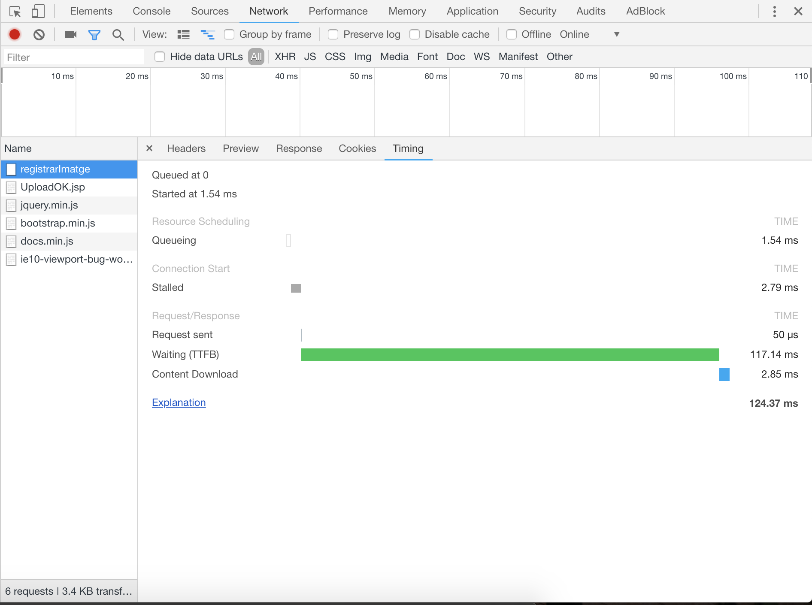
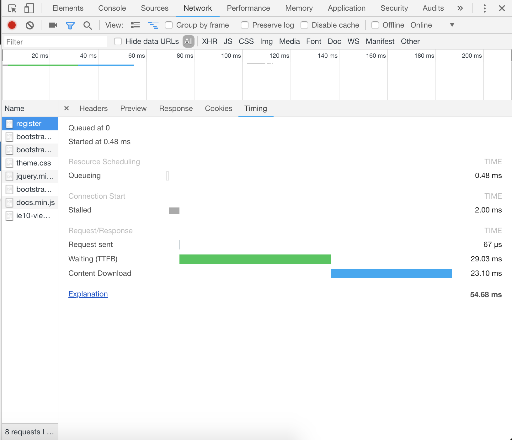

# Informe final prácticas 2 a 5
Contesta a las siguientes cuestiones referentes a las prácticas.

## Práctica 2:
1. Copia en el cuadro el código del servlet que recoge los datos del formulario para registrar una imagen, guardarlos en la base de datos y almacenar el fichero con la imagen en disco.


``` java
protected void doPost(HttpServletRequest request, HttpServletResponse response)
       throws ServletException, IOException {

    response.setContentType("text/html;charset=UTF-8");

// Create path components to save the file
final String path = ("C:\\Users\\rando\\OneDrive\\Documents\\GitHub\\FIB-AD\\Laboratori\\P2\\WAP1\\web\\Image");
final Part filePart = request.getPart("imatge");
String fileName = getFileName(filePart);
int id;
String titol = request.getParameter("titol");
String descripcio = request.getParameter("descripcio");
String tags = request.getParameter("tags");
String autor = request.getParameter("autor");
String datac = request.getParameter("datac");
String user=null;
Cookie[] cookies = request.getCookies();
   if(cookies !=null){
     for(Cookie cookie : cookies){
             if(cookie.getName().equals("username")) user = cookie.getValue();
     }
   }

Date date= new Date();
long time = date.getTime();
String timestamp = Long.toString(time);
OutputStream out = null;
InputStream filecontent = null;
final PrintWriter writer = response.getWriter();
Connection conn = null;


int lastDot = fileName.lastIndexOf('.');
fileName = timestamp + fileName.substring(lastDot);

try {

   Class.forName("org.sqlite.JDBC");

       // Connexió Sergi
       try {
           conn = DriverManager.getConnection("jdbc:sqlite:C:\\Users\\rando\\OneDrive\\Documents\\GitHub\\FIB-AD\\Laboratori\\P2\\WAP1\\FotOK.db");
           Statement statement = conn.createStatement();
           statement.setQueryTimeout(30);
       }
       // Connexió Marc
       catch(SQLException e) {
           try{
             conn = DriverManager.getConnection("jdbc:sqlite:FotOK.db");
             Statement statement = conn.createStatement();
             statement.setQueryTimeout(30);
           }
           catch(SQLException ex){
               System.out.println("No es troba cap base de dades d'usuaris");
           }

       }

   PreparedStatement getid = conn.prepareStatement("SELECT MAX(id) FROM imatges");
   ResultSet rs = getid.executeQuery();
   if(rs.next()) id = rs.getInt(1)+1;
   else id=0;

   try{
     PreparedStatement pujafoto = conn.prepareStatement("INSERT INTO imatges(filename,id,titol,descripcio,tags,autor,datac,timestamp,username) VALUES(?,?,?,?,?,?,?,?,?)");
     pujafoto.setString(1,fileName);
     pujafoto.setInt(2,id);
     pujafoto.setString(3,titol);
     pujafoto.setString(4,descripcio);
     pujafoto.setString(5,tags);
     pujafoto.setString(6,autor);
     pujafoto.setString(7,datac);
     pujafoto.setString(8,timestamp);
     pujafoto.setString(9,user);
     pujafoto.executeUpdate();
   }
   catch (SQLException e){
        response.sendRedirect("error.jsp");
   }
   out = new FileOutputStream(new File(path + File.separator + fileName));
   filecontent = filePart.getInputStream();

   int read = 0;
   final byte[] bytes = new byte[1024];

   while ((read = filecontent.read(bytes)) != -1) {
       out.write(bytes, 0, read);
   }
   writer.println("New file " + fileName + " created at " + path);
   LOGGER.log(Level.INFO, "File{0}being uploaded to {1}",
   new Object[]{fileName, path});
   response.sendRedirect("UploadOK.jsp");
}


catch (FileNotFoundException fne) {
    writer.println("You either did not specify a file to upload or are "
    + "trying to upload a file to a protected or nonexistent "
    + "location.");
    writer.println("<br/> ERROR: " + fne.getMessage());

    LOGGER.log(Level.SEVERE, "Problems during file upload. Error: {0}",
    new Object[]{fne.getMessage()});
    response.sendRedirect("error.jsp");
}      
catch (SQLException ex) {
    Logger.getLogger(registrarImagen.class.getName()).log(Level.SEVERE, null, ex);
}
catch (ClassNotFoundException ex) {
    Logger.getLogger(registrarImagen.class.getName()).log(Level.SEVERE, null, ex);
}
finally {
    if (out != null) {
        out.close();
    }
    if (filecontent != null) {
        filecontent.close();
    }
    if (writer != null) {
        writer.close();
    }
    try {
        if(conn != null)
        conn.close();
    }
    catch(SQLException e) {
        // connection close failed.
        System.err.println(e.getMessage());
    }
}

}

private String getFileName(final Part part) {
    final String partHeader = part.getHeader("content-disposition");
    LOGGER.log(Level.INFO, "Part Header = {0}", partHeader);
    for (String content : part.getHeader("content-disposition").split(";")) {
        if (content.trim().startsWith("filename")) {
            return content.substring(
            content.indexOf('=') + 1).trim().replace("\"", "");
        }
    }
    return null;
}


 ```

2. Copia en el cuadro el código del formulario html que pide al usuario los datos de una imagen para registrarla. Según como lo hayáis implementado, puede ser código html o una página jsp.

``` html

<form class="form-signin" action="registrarImagen" method="POST" enctype="multipart/form-data">


            <input class="form-control" type="file" id="imatge" name="imatge" required autofocus>
            <input class="form-control" type="text" name="titol" placeholder="Títol" required>
            <input  class="form-control" type="text" name="descripcio" placeholder="Descripció" required>
            <input class="form-control" type="text" name="tags" placeholder="Tags separats amb ';'  Exemple: (naturalesa;animals;maincra) " required>
            <input  class="form-control" type="text" name="autor" placeholder="Autor" required>
            <input  class="form-control" type="date" name="datac" required>

        <button class="btn btn-lg btn-primary btn-block" type="submit">Puja</button>
      </form>
```

## Práctica 3:
1. Copia en el cuadro la operación de registro de una imagen en SOAP.

``` java
@WebMethod(operationName = "registerImage")
    public int registerImage(@WebParam(name = "image") ImageWS image) {

        Date date = new Date();
        long time = date.getTime();
        String timestamp = Long.toString(time);
        Connection conn = null;
        int id;

        try {
            Class.forName("org.apache.derby.jdbc.ClientDriver");

            // create a database connection
            conn = DriverManager.getConnection("jdbc:derby://localhost:1527/FotOK;user=mcasellas;password=1234");
            Statement statement = conn.createStatement();
            statement.setQueryTimeout(30);

            PreparedStatement getid = conn.prepareStatement("SELECT MAX(id) FROM imatges");
            ResultSet rs = getid.executeQuery();
            if (rs.next()) {
                id = rs.getInt(1) + 1;
            } else {
                id = 0;
            }

            String filename = timestamp + ".jpg";

            try {
                PreparedStatement pujafoto = conn.prepareStatement("INSERT INTO imatges(filename,id,titol,descripcio,tags,autor,datac,timestamp,username) VALUES(?,?,?,?,?,?,?,?,?)");
                pujafoto.setString(1, filename);
                pujafoto.setInt(2, id);
                pujafoto.setString(3, image.getTitol());
                pujafoto.setString(4, image.getDescripcio());
                pujafoto.setString(5, image.getTags());
                pujafoto.setString(6, image.getAutor());
                pujafoto.setString(7, image.getDatac());
                pujafoto.setString(8, timestamp);
                pujafoto.setString(9, image.getUsername());
                pujafoto.executeUpdate();

            } catch (SQLException e) {
                return 0;
            }

        } catch (SQLException ex) {
            System.out.println("No es troba cap base de dades d'usuaris");
        } catch (ClassNotFoundException ex) {
            Logger.getLogger(FotOkWS.class.getName()).log(Level.SEVERE, null, ex);
        } finally {
            try {
                if (conn != null) {
                    conn.close();
                }
            } catch (SQLException e) {
                // connection close failed.
                System.err.println(e.getMessage());
            }
        }

        return 1;
    }
```
2. Copia en el cuadro la operación de búsqueda por título en SOAP.

``` java
@WebMethod(operationName = "searchByTitle")
    public List searchByTitle(@WebParam(name = "title") String title) {
        //TODO write your implementation code here:
        Connection con = null;
        ArrayList<ImageWS> resultat = new ArrayList<ImageWS>();
        try {

            Class.forName("org.apache.derby.jdbc.ClientDriver");

            // create a database connection
            con = DriverManager.getConnection("jdbc:derby://localhost:1527/FotOK;user=mcasellas;password=1234");
            Statement statement = con.createStatement();
            statement.setQueryTimeout(30);
            try {
                PreparedStatement getphotos = con.prepareStatement("SELECT * FROM imatges WHERE titol LIKE ?");
                getphotos.setString(1, title);
                ResultSet rs = getphotos.executeQuery();
                while (rs.next()) {
                    ImageWS temp = new ImageWS();
                    temp.filename = rs.getString("filename");
                    temp.id = rs.getInt("id");
                    temp.titol = rs.getString("titol");
                    temp.descripcio = rs.getString("descripcio");
                    temp.tags = rs.getString("tags");
                    temp.autor = rs.getString("autor");
                    temp.datac = rs.getString("datac");
                    temp.timestamp = rs.getString("timestamp");
                    temp.username = rs.getString("username");

                    resultat.add(temp);
                }
            } catch (SQLException e) {
                System.err.println(e.getMessage());
                return null;
            }

        } catch (SQLException e) {
            System.err.println(e.getMessage());
            return null;
        } catch (ClassNotFoundException ex) {
            Logger.getLogger(FotOkWS.class.getName()).log(Level.SEVERE, null, ex);
        } finally {

            try {
                if (con != null) {
                    con.close();
                }

            } catch (SQLException e) {
                // connection close failed.
                System.err.println(e.getMessage());
                return null;
            }
        }

        return resultat;
    }
```

3. Copia en el cuadro el código que llama a una de las operaciones del servicio web de imágenes en SOAP.

``` html
<%@page import="java.sql.SQLException"%>
<%@page import="java.sql.ResultSet"%>
<%@page import="java.sql.PreparedStatement"%>
<%@page import="java.sql.Statement"%>
<%@page import="java.sql.DriverManager"%>
<%@page import="java.sql.Connection"%>


<!DOCTYPE html>
<html lang="en">
  <head>
    <meta charset="utf-8">
    <meta http-equiv="X-UA-Compatible" content="IE=edge">
    <meta name="viewport" content="width=device-width, initial-scale=1">
    <meta name="description" content="">
    <meta name="author" content="">
    <title>FotOK</title>
    <link href="./css/bootstrap.min.css" rel="stylesheet">
    <link href="./css/bootstrap-theme.min.css" rel="stylesheet">
    <link href="theme.css" rel="stylesheet">

  </head>

  <body>

    <nav class="navbar navbar-inverse navbar-fixed-top">
      <div class="container">
        <div class="navbar-header">
          <button type="button" class="navbar-toggle collapsed" data-toggle="collapse" data-target="#navbar" aria-expanded="false" aria-controls="navbar">
            <span class="sr-only">Toggle navigation</span>
            <span class="icon-bar"></span>
            <span class="icon-bar"></span>
            <span class="icon-bar"></span>
          </button>
          <a class="navbar-brand" href="#">FotOK</a>
        </div>
        <div id="navbar" class="navbar-collapse collapse">
          <ul class="nav navbar-nav">
            <li ><a href="./menu.jsp">Inici</a></li>
            <li class="active"><a href="./registrarImagen.jsp">Registrar Imatge</a></li>
            <li><a href="./list.jsp">Llista les imatges</a></li>
            <li><a href="./buscarImagen.jsp">Busca una imatge</a></li>
            <li><form class="form-signin" action="logout" method="POST">


      </form> </li>
          </ul>
        </div><!--/.nav-collapse -->
      </div>
    </nav>

    <div class="container theme-showcase" role="main">

      <!-- Main jumbotron for a primary marketing message or call to action -->


      <div class="page-header">
        <h1>Registrar imatge:</h1>
      </div>

      <div class="row">

          <div class="panel panel-default">
            <div class="panel-heading">
              <h3 class="panel-title">Nova imatge</h3>
            </div>
            <div class="panel-body">
            <form class="form-signin" action="registrarImatge" method="POST">


            <input class="form-control" type="text" name="titol" placeholder="Títol" required>
            <input  class="form-control" type="text" name="descripcio" placeholder="Descripció" required>
            <input class="form-control" type="text" name="tags" placeholder="Tags separats amb ';'  Exemple: (naturalesa;animals;maincra) " required>
            <input  class="form-control" type="text" name="autor" placeholder="Autor" required>
            <input  class="form-control" type="date" name="datac" required>

        <button class="btn btn-lg btn-primary btn-block" type="submit">Puja</button>
      </form>


            </div>
          </div>


      </div>
    </div> <!-- /container -->

    <!-- Bootstrap core JavaScript
    ================================================== -->
    <!-- Placed at the end of the document so the pages load faster -->
    <script src="https://ajax.googleapis.com/ajax/libs/jquery/1.12.4/jquery.min.js"></script>
    <script>window.jQuery || document.write('<script src="../../assets/js/vendor/jquery.min.js"><\/script>')</script>
    <script src="./js/bootstrap.min.js"></script>
    <script src="./js/docs.min.js"></script>
    <!-- IE10 viewport hack for Surface/desktop Windows 8 bug -->
    <script src="./js/ie10-viewport-bug-workaround.js"></script>
  </body>
</html>
```


## Práctica 4:
1. Copia en el cuadro la operación para modificar una imagen ya existente en REST.

> Para modificar una imagen usamos dos operaciones, una para modificar los campos, y otra que se encarga de hacer la modificacion en la base de datos.

```JavaScript
/**
* GET method to modify by id
* @param id
* @return
*/
@Path("modify")
@POST
@Consumes(MediaType.APPLICATION_FORM_URLENCODED) @Produces(MediaType.TEXT_HTML)
public String modifyImage (@FormParam("id") int id) throws ClassNotFoundException {
    //TODO write your implementation code here:
        Connection con = null;
        String resultat = "Error";
        try {

            try {
                Class.forName("org.apache.derby.jdbc.ClientDriver");
            con = DriverManager.getConnection("jdbc:derby://localhost:1527/FotOK;user=mcasellas;password=1234");


            Statement statement = con.createStatement();

            statement.setQueryTimeout(30);

            } catch (SQLException e) {
                System.out.println("No es troba cap base de dades d'usuaris");
                System.err.println(e.getMessage());
            }
            try {

                PreparedStatement getImatge = con.prepareStatement("SELECT * FROM IMATGES WHERE ID = ?");

                getImatge.setInt(1, id);
                ResultSet rs = getImatge.executeQuery();

                while (rs.next()) {
                    resultat = "<form class='form-signin' action='http://localhost:8080/RestAD/webresources/generic/modify_values/" + rs.getString("id") +"' method='POST'>"
                    + " <input class='form-control' value='" + rs.getString("titol") +  "' type='text' name='title' placeholder='Títol' required>"
                    + "      <input  class='form-control' value='" + rs.getString("descripcio") +  "' type='text' name='description' placeholder='Descripció' required>"
                    + "     <input class='form-control' value='" + rs.getString("tags") +  "' type='text' name='keywords' placeholder='Tags separats amb ;  Exemple: (naturalesa;animals;maincra) ' required>"
                    + "     <input  class='form-control' value='" + rs.getString("autor") +  "' type='text' name='author' placeholder='Autor' required>"
                    + "     <input  class='form-control' value='" + rs.getString("datac") +  "' type='date' name='creation' required>"
                    + " <button class='btn btn-lg btn-primary btn-block' type='submit'>Puja</button>"
                    + "  </form>";
                }


            } catch (SQLException e) {
                System.err.println(e.getMessage());
            }
        } catch (ClassNotFoundException ex) {
            System.err.println(ex.getMessage());
        } finally {
            try {
                if (con != null) {
                    con.close();
                }
            } catch (SQLException e) {
                // connection close failed.
                System.err.println(e.getMessage());
            }

        }
        return banner + "Modificar imatge:" + mig + resultat + footer;
}


/**
* POST method to register a new image
* @param id
* @param title
* @param description
* @param keywords
* @param author
* @param crea_date
* @return
*/
@Path("modify_values/{id}")
@POST
@Consumes(MediaType.APPLICATION_FORM_URLENCODED) @Produces(MediaType.TEXT_HTML)
public String modifyImage (@PathParam("id") int id, @FormParam("title") String title,
@FormParam("description") String description, @FormParam("keywords") String keywords, @FormParam("author") String author, @FormParam("creation") String creation){

        Connection con = null;
        String resultat = "<h3>No s'ha pogut modificar la imatge<h3>";
        try {

            try {

                Date date = new Date();
        long time = date.getTime();
        String timestamp = Long.toString(time);
        String filename = timestamp + ".jpg";

        Class.forName("org.apache.derby.jdbc.ClientDriver");
        con = DriverManager.getConnection("jdbc:derby://localhost:1527/FotOK;user=mcasellas;password=1234");


        PreparedStatement updateFoto = con.prepareStatement("UPDATE IMATGES SET TITOL = ?, DATAC = ?, TAGS = ?, DESCRIPCIO = ?, AUTOR = ? WHERE ID = ?");
                updateFoto.setString(1, title);
                updateFoto.setString(2, creation);
                updateFoto.setString(3, keywords);
                updateFoto.setString(4, description);
                updateFoto.setString(5, author);
                updateFoto.setInt(6, id);

                int num = updateFoto.executeUpdate();


                resultat = "<h3>S'ha modificat la imatge correctament<h3>"
+ "<div class='list-group'><div class='list-group'>"
+ "<a href='./webresources/generic/list' class='list-group-item active'>Llista les imatges</a>"
+ ""
+ "</div>";


            } catch (SQLException e) {
                System.err.println(e.getMessage());
            }
        } catch (ClassNotFoundException ex) {
            System.err.println(ex.getMessage());
        } finally {
            try {
                if (con != null) {
                    con.close();
                }
            } catch (SQLException e) {
                // connection close failed.
                System.err.println(e.getMessage());
            }

        }
        return banner + "Modificar imatges:" + mig + resultat + footer;
}

```

2. Copia en el cuadro la operación para buscar una imagen por palabra clave en REST.

```java
/**
* GET method to search images by keyword
* @param keywords
* @return
*/
@Path("searchKeywords/{keywords}")
@GET
@Produces(MediaType.TEXT_HTML)
public String searchByKeywords (@PathParam("keywords") String
keywords) throws ClassNotFoundException{
    Connection con = null;
    String resultat = "<h3>No hi han imatges<h3>";
    try {
        Class.forName("org.apache.derby.jdbc.ClientDriver");
        con = DriverManager.getConnection("jdbc:derby://localhost:1527/FotOK;user=mcasellas;password=1234");

        PreparedStatement getphotos = con.prepareStatement("SELECT * FROM imatges WHERE TAGS LIKE ?");
        String cerca = '%' + keywords + '%';
        getphotos.setString(1, cerca);
        ResultSet rs = getphotos.executeQuery();
        resultat = llistarImatges(rs);  

    }
    catch (SQLException e) {
            System.out.println("Error amb la base de dades");

            System.err.println(e.getMessage());
        }
    return banner + "Buscar imatges per tags:" + mig + resultat + footer;
}
```


3. Copia en el cuadro el código que llama a una de las operaciones del servicio web de imágenes en REST.

Código que llama a las operaciones de búsqueda de imagenes.

```html
<%@page import="java.util.ArrayList"%>
<%@page import="java.util.ArrayList"%>
<%@page import="java.sql.SQLException"%>
<%@page import="java.sql.ResultSet"%>
<%@page import="java.sql.PreparedStatement"%>
<%@page import="java.sql.Statement"%>
<%@page import="java.sql.DriverManager"%>
<%@page import="java.sql.Connection"%>


<!DOCTYPE html>
<html lang="en">
  <head>
    <meta charset="utf-8">
    <meta http-equiv="X-UA-Compatible" content="IE=edge">
    <meta name="viewport" content="width=device-width, initial-scale=1">
    <meta name="description" content="">
    <meta name="author" content="">
    <title>FotOK</title>
    <link href="./css/bootstrap.min.css" rel="stylesheet">
    <link href="./css/bootstrap-theme.min.css" rel="stylesheet">
    <link href="theme.css" rel="stylesheet">
<link rel="shortcut icon" href="./favicon.ico">
  </head>

  <body>

    <nav class="navbar navbar-inverse navbar-fixed-top">
      <div class="container">
        <div class="navbar-header">
          <button type="button" class="navbar-toggle collapsed" data-toggle="collapse" data-target="#navbar" aria-expanded="false" aria-controls="navbar">
            <span class="sr-only">Toggle navigation</span>
            <span class="icon-bar"></span>
            <span class="icon-bar"></span>
            <span class="icon-bar"></span>
          </button>
          <a class="navbar-brand" href="#">FotOK</a>
        </div>
        <div id="navbar" class="navbar-collapse collapse">
          <ul class="nav navbar-nav">
            <li><a href="./menu.jsp">Inici</a></li>
            <li><a href="./registrarImagen.jsp">Registrar Imatge</a></li>
            <li><a href="./webresources/generic/list">Llista les imatges</a></li>
            <li class="active"><a href="./buscarImagen.jsp">Busca una imatge</a></li>
            <li>
                <form class="form-signin" action="logout" method="POST"></form>
            </li>
          </ul>
        </div><!--/.nav-collapse -->
      </div>
    </nav>

    <div class="container theme-showcase" role="main">

      <!-- Main jumbotron for a primary marketing message or call to action -->


      <div class="page-header">
        <h1>Buscar imatges:</h1>
      </div>

      <div class="row">

          <div class="panel panel-default">
            <div class="panel-heading">
              <h3 class="panel-title">Nova imatge</h3>
            </div>
            <div class="panel-body">
              <form onchange="afegirPath()" id="formulari" class="form-signin" action="./webresources/generic/searchByID/" method="GET">
               <select name="accio" id="accio">
                <option value="ID">Id</option>
                <option value="Title">Titol</option>
                <option value="Author">Autor</option>
                <option value="CreationDate">Data de creació</option>
                <option value="Keywords">Tags</option>
            </select>
            <input class="form-control" type="number" id="text" name="text" required autofocus>


        <button class="btn btn-lg btn-primary btn-block" type="submit">Buscar</button>
      </form>

            </div>
          </div>


      </div>


    </div> <!-- /container -->
    <script>
        function afegirPath() {
            var accio = document.getElementById("accio").value;

            document.getElementById("text").type = accio == "ID" ? "number" : "text";

            var data = document.getElementById("text").value;
            var result = "./webresources/generic/search" + accio + '/' + data;
            document.getElementById("formulari").action = result;
        }
    </script>

    <!-- Bootstrap core JavaScript
    ================================================== -->
    <!-- Placed at the end of the document so the pages load faster -->
    <script src="https://ajax.googleapis.com/ajax/libs/jquery/1.12.4/jquery.min.js"></script>
    <script>window.jQuery || document.write('<script src="../../assets/js/vendor/jquery.min.js"><\/script>')</script>
    <script src="./js/bootstrap.min.js"></script>
    <script src="./js/docs.min.js"></script>
    <!-- IE10 viewport hack for Surface/desktop Windows 8 bug -->
    <script src="./js/ie10-viewport-bug-workaround.js"></script>
  </body>
</html>

```

## Práctica 5:
1. Compara los siguientes aspectos de la funcionalidad desarrollada en las prácticas 2, 3 y 4.
Facilidad de implementación de la parte cliente y la parte servidor.

> Para la practica 2, la implementación tanto del cliente como del servidor fueron las tareas mas complejas. Para el cliente tuvimos que implementar un sistema de sesiones para cada pagina jsp de manera que solo los usuarios registrados pudiesen acceder a los servicios que ofreciamos, luego, los servlets se encargaban de gestionar todos los datos que le pasabmos por fomularios des de la jsp. Un factor importante a tener en cuenta a la hora de la dificultat de implementacion del cliente y el servidor era la poca experiencia que teniamos en la implementación de servicios, cosa que gracias a esta primera practica nos hizo mucho mas fácil el desarrollo de las siguientes. En esta implementación, la base de datos se accedia mediante una función que primero probaba la conexión con un integrante del grupo, y luego, en caso de fallo con el otro. Para las siguintes prácticas la base de datos se implementó de forma distinta para facilitar su uso, conexión y gestión.

> Para la práctica 3, la mayor dificultad fue entender como funcionaba el servicio a traves de llamadas a funciones, para esta práctica, la implementacion de la base de datos la integramos directamente en netbeans, porque los integrantes del grupo trabajamos con diferentes sistemas operativos, y nos resultaba mas facil que implementar funciones de conexión a base de datos en directorios.

> La practica 4 fue la mas sencilla en cuanto implementacion del cliente, ya que la mayoria de paginas html nos las retornaba el mismo servidor. Tuvimos que crear algunas pocas paginas de navegacion y el resto eran las funciones SOAP. La implmentación del servidor no fue muy difícil, generabamos las cabeceras con dos strings para mantener el diseño de la web, y luego implementabamos una fusión del codigo java y html que nos retornaba la página que pedia la petición.

2. Tiempo de respuesta para la funcionalidad de registro de imagen. Para poder realizar la comparación, comenta la parte de upload de la página en la Práctica 2.

El tiempo de respuesta se corresponde a la linea verde para cada implementación.

Los tiempos de respuesta son los siguientes:

```
Práctica 2: 17.27 ms

Práctica 3: 117.14 ms

Práctica 4: 29.03 ms
```

Práctica 2


Práctica 3



Práctica 4



3. Compara el formato de las peticiones y las respuestas en SOAP y REST. ¿Cómo se realiza el envío de objetos complejos como por ejemplo las listas en ambos servicios?

##### SOAP

**Cabecera petición.**

```
GET /P3_SOAP_JSP_Client/list.jsp HTTP/1.1
Host: localhost:8080
Connection: keep-alive
Cache-Control: max-age=0
Upgrade-Insecure-Requests: 1
User-Agent: Mozilla/5.0 (Macintosh; Intel Mac OS X 10_14_1) AppleWebKit/537.36 (KHTML, like Gecko) Chrome/70.0.3538.110 Safari/537.36
Accept: text/html,application/xhtml+xml,application/xml;q=0.9,image/webp,image/apng,*/*;q=0.8
Referer: http://localhost:8080/P3_SOAP_JSP_Client/
Accept-Encoding: gzip, deflate, br
Accept-Language: en-GB,en;q=0.9,es-ES;q=0.8,es;q=0.7,ca-ES;q=0.6,ca;q=0.5,en-US;q=0.4
Cookie: JSESSIONID=b2cdff4f1fd1a33605281de3ed8c
```


**Cabecera respuesta.**

```
HTTP/1.1 200 OK
Server: GlassFish Server Open Source Edition  4.1.1
X-Powered-By: JSP/2.3
Content-Type: text/html;charset=ISO-8859-1
Date: Wed, 28 Nov 2018 16:36:17 GMT
Transfer-Encoding: chunked
```


##### REST

**Cabecera petición.**

```
GET /RestAD/webresources/generic/list HTTP/1.1
Host: localhost:8080
Connection: keep-alive
Upgrade-Insecure-Requests: 1
User-Agent: Mozilla/5.0 (Windows NT 10.0; Win64; x64) AppleWebKit/537.36 (KHTML, like Gecko) Chrome/70.0.3538.110 Safari/537.36
Accept: text/html,application/xhtml+xml,application/xml;q=0.9,image/webp,image/apng,*/*;q=0.8
Referer: http://localhost:8080/RestAD/webresources/generic/list
Accept-Encoding: gzip, deflate, br
Accept-Language: es-ES,es;q=0.9
Cookie: JSESSIONID=b23aa045278dc02963ef2bc85260
```

**Cabecera respuesta.**

```
HTTP/1.1 200 OK
Server: GlassFish Server Open Source Edition  4.1.1
X-Powered-By: Servlet/3.1 JSP/2.3 (GlassFish Server Open Source Edition  4.1.1  Java/Oracle Corporation/1.8)
Content-Type: text/html
Date: Wed, 28 Nov 2018 16:25:37 GMT
Transfer-Encoding: chunked
```

> En ambos servicios se retorna una pagina html, pero la información se trata de manera distinta. Mientras que en el servicio SOAP, una vez hecha la petición, esta devuelve una lista con todas las imagenes, luego es la propia página jsp que gestiona la informacion de esta, que va generando la pagina html mediante operaciones en Java. Para el servicio Rest, en cambio, al hacer la petición de imágenes es la propia función la que genera el html y lo devuelve en forma de String, de manera que no se pasa ninguna lista.

## Todas las prácticas:
1. Detalla las ampliaciones que hayas realizado en cada práctica. Algunos ejemplos de ampliaciones son: funcionalidades extra de gestión de imágenes (p. e. borrado), jsp para gestión de errores, funciones extra de búsqueda, etc. Puedes copiar el código correspondiente a cada ampliación.

> Para la práctica 2, implementamos paginas de error jsp para control de errores, para esta práctica eran realmente necesarias especialmente para la subida de ficheros, ya que era la fuente que nos podia causar mas problemas. Estas paginas de error tambien se usan para funcionalidades de subida, modicficacion de imagenes y para el Login. Relacionado con el login, también implementamos un sistema de sesiones mediante cokkies, ya que http es un protocolo sin estado. Estas cookies, nos permetian que cuando alguien se conectase al servicio sea redirigido correctamente, por ejemplo: Una persona quiere acceder a nuestro servicio web, sin embargo, no esta registrado y por lo tanto, no esta en la base de datos. Con el uso de cookies, si esta persona quieren entrar por ejemplo en "http://.../menu.jsp" será redirigido a la pagina de Login ya que no tendrá ninguna sessión iniciada.

> El control de sesión, además, nos permitió que en las páginas de listar y de búsqueda  pudiesemos añadir la funcionalidad de que cada usuario pudiese modificar la imagen desde alli, de manera que solo el usuario que ha colgado la imagen puede editarla.

> De la misma manera que implementamos un servicio de Login con control de sesion, tambien implementamos un servicio de logout.

> Para la implementación de la busqueda en la práctica 2, nuestro web service permite hacer una busqueda general, que busca en todos los campos de "metadatos" que tiene la imagen, ya sea Autor, Título, Tags... Esto nos devuelve un resultado mas amplio de la búsqueda aunque en términos de eficiencia no es tan bueno, ya que tiene que buscar por toda la base de datos, aunque los tiempos de respuesta son cortos y por eso consideramos implementarlo de esa manera. Tener en cuenta que nuestra base de datos es pequeña, por lo tanto tampoco se podia dar un escenario en que la busqueda fuera realmente eficiente.

> Para la práctica 3, quisimos intentar aportar la misma experiencia de uso tanto para el cliente web como en el cliente java, de manera que implementamos un cliente java totalmente funcional, con su respectivo menú, y formularios para las funciones. Estos "formularios" se basan en ir pidiendo la información al usuario de manera que es facil trabajar con el webservice desde la consola, ya que en todo momento se muestran todas las funcionalidades disponibles en el momento. La navegación se basa fundamentalmente en acceder a los distintos servicios mediante números de manera que se muestran por pantalla menús como:

```
1-Registrar imagen
2-Listar imágenes
3-Modificar imagen
4-Buscar imagen
```

> Para la práctica 4 implementamos un formulario de busqueda que te dejase buscar por campos, de manera que si por ejemplo, quieres buscar por ID(campo numérico), el campo de texto donde introduciremos las palabras clave solo permite la introducción de números.

> Las Prácticas 3 y 4 no incluyen muchas funcionalidades extra respecto a que se pedia en las mismas, aún así, tanto en la práctica 2, 3 y 4 se implementan las siguientes funcionalidades: Hojas de estilo CSS, con el objetivo de tener un web service que permita una navegación mas sencilla resaltando elementos importantes como por ejemplo, botones resaltados en azul para redirección a paginas de "Modificación de imagen" o para la práctica 2, un boton de Logout resaltado en amarillo, intentando cumplir así, las reglas básicas de diseño de interficies. Usamos tambien divisones para repartir bien la información de manera que se muestra clara y precisa de cara al usuario. Todas las prácticas cuentan con un barra superior de navegación, lo que permite al usuario navegar por todas las funcionalidades del web service de manera sencilla.

> Finalmente, pero sin importancia, diseñamos algun logo para dar un aspecto mas atractivo al webservice, siempre teniendo en cuenta que el principal objetivo de las prácticas era desarrollar las funcionalidades de estas, y no el diseño en si.
